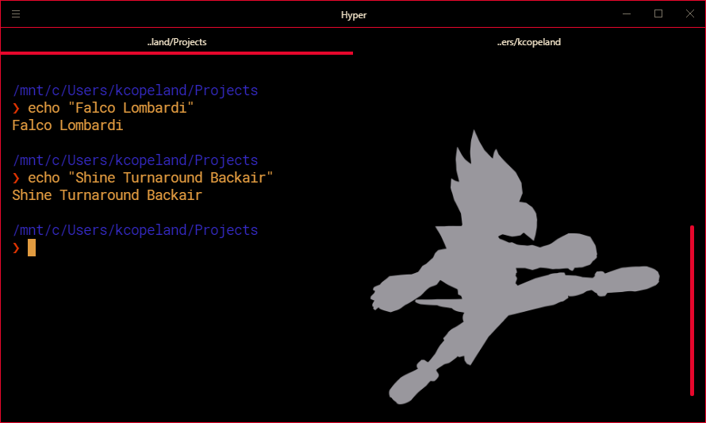

# hyper-smash
Smash Brothers terminals for [Hyper.js](https://hyper.is/)



# Available Characters
:bird: Falco Lombarid [YO PP](https://youtu.be/DEsp996TGak?t=587)


## Usage
Simply add the theme to your `~/.hyper.js`:

```js
plugins: [
  'hyper-smash'
]
```

## Inspiration

* Hyper Pokemon Theme: https://github.com/klaussinani/hyper-pokemon
* Smash Brothers Documentary [Life Changing Documentary](https://www.youtube.com/watch?v=NSf2mgkRm7Q&list=PLoUHkRwnRH-IXbZfwlgiEN8eXmoj6DtKM)

## Contribute

1. [Fork](https://help.github.com/articles/fork-a-repo/) this repository to your own GitHub account and then [clone](https://help.github.com/articles/cloning-a-repository/) it to your local device (make sure that it's located in `~/.hyper-plugins/local`)
2. Add "hyper-smash" to the `localPlugins` property within `~/.hyper.js`
3. Restart Hyper

## Author
Kyle Copeland
